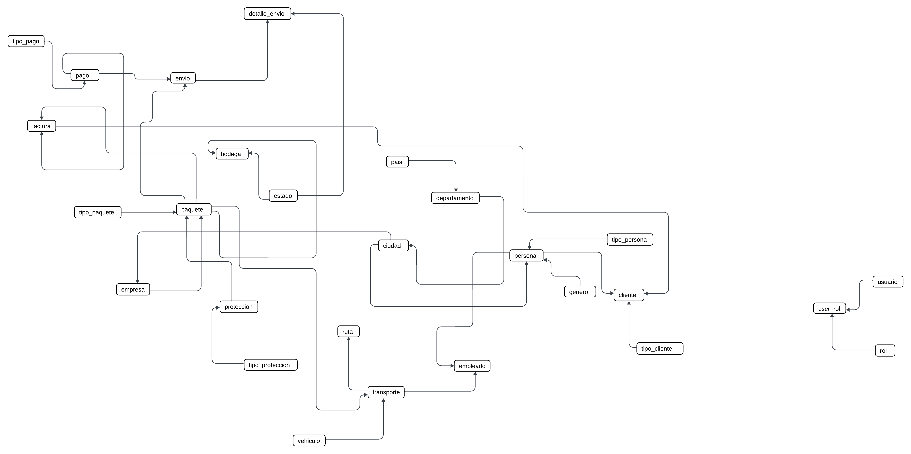
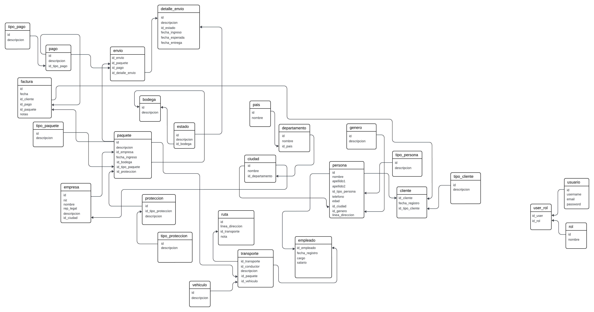
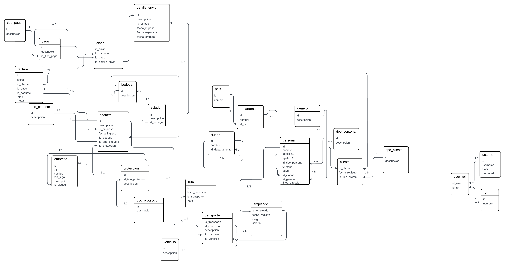
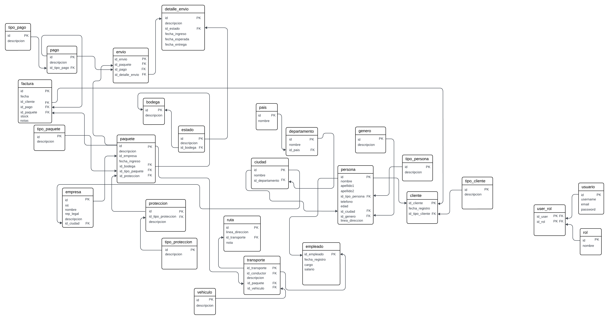

<h1 align="center"><b>PushUp - Database - Coordinadora</b></h1>

At Coordinadora, we recognize the importance of the ability to solve challenges in the success of
our team. To evaluate your problem-solving skills

## Tecnologies 🧑🏻‍💻

 

- **Softwares & Tools**: 
  
  

 

## Functional requirements 👻 
🎯 Prepare the logical, physical and relational diagrams. ✔  
🎯 Normalize the database up to 4NF. ✔  

## Logical Diagram  

The design of entities and relationships is applied

## Physical Diagram  

The design of entities, attributes and relationships is applied

## Relational Diagram  

The design of entities, attributes and specified relationships is applied

## Normalization To 4FN  

The design of entities, attributes and relationships, applying normalization models up to 4NF

### Author  
- Powered by <a href="https://github.com/IgmarLozadaBolivar">Igmar Lozada</a> 

